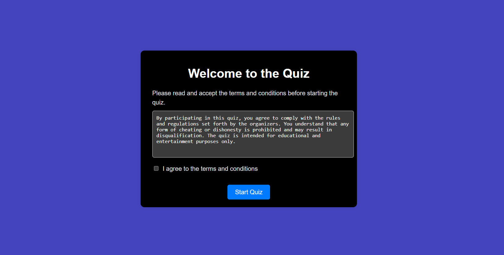
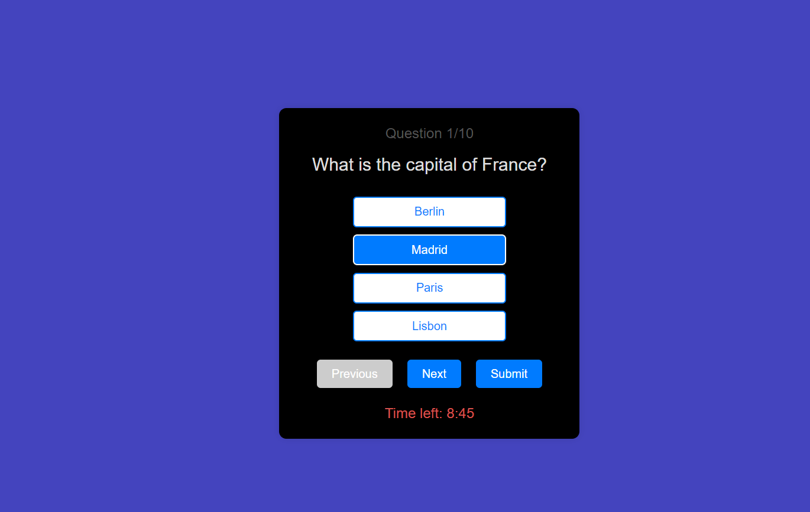
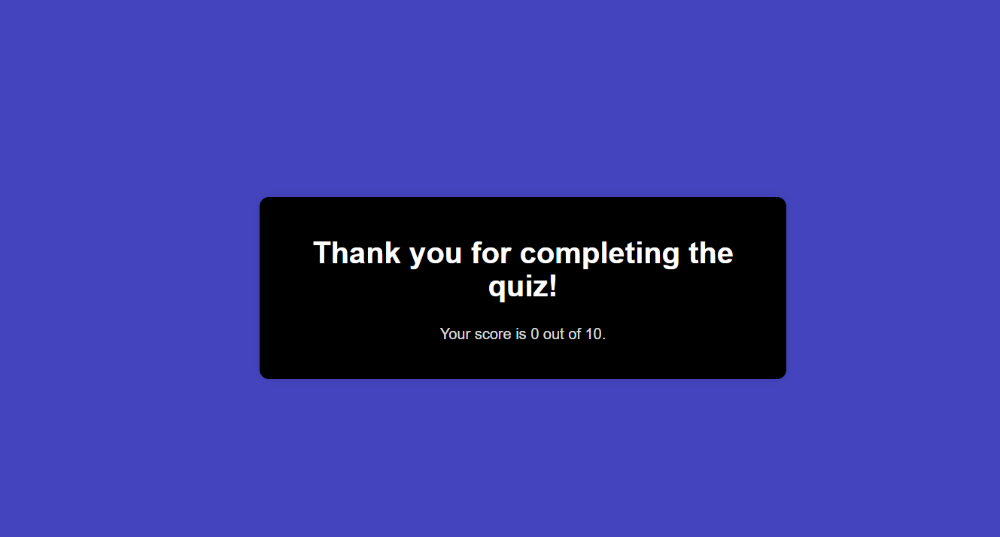

# Quiz Application

This is a React-based quiz application that features multiple-choice questions, automatic saving of progress, and a 10-minute timer.

## Features

- **Multiple-choice questions**: Questions and options are loaded from a JSON file.
- **Full-screen mode**: The quiz can only be taken in full-screen mode.
- **Automatic progress saving**: Saves the current question and remaining time.
- **Navigation**: Includes "Next" and "Previous" buttons to navigate between questions.
- **Timer**: A 10-minute timer for completing the quiz.
- **Terms and conditions**: Requires acceptance before starting the quiz.
- **Score display**: Shows the score and a thank you message after submission.

## Getting Started

### Prerequisites

- [Node.js](https://nodejs.org/) (version 12 or higher)
- [npm](https://www.npmjs.com/) or [yarn](https://yarnpkg.com/)

### Installation

1. **Clone the repository**:

  ```sh
  git clone https://github.com/username/quiz-app.git
  cd quiz-app
  ```

2. **Install dependencies**:

  ```sh
  npm install
  ```

3. **Start the development server**:

  ```sh
  npm start
  ```

4. Open your browser and go to http://localhost:3000 to see the application.

## Deployment

To deploy this project using Vercel:

1. Push your code to a GitHub repository.
2. Go to Vercel, log in, and create a new project by importing your GitHub repository.
3. Follow the prompts to deploy your project.

## Usage

1. Read and accept the terms and conditions to start the quiz.
2. Select an answer for each question.
3. Navigate using the "Next" and "Previous" buttons.
4. Submit the quiz to see your score.

## Project Structure

```
/public
  /questions.json
/src
  /App.js
  /App.css
  /index.js
```

- `questions.json`: Contains the quiz questions and answer options.
- `App.js`: Main component with quiz logic.
- `App.css`: Styles for the application.
- `index.js`: Entry point of the React application.

## JSON Structure

`questions.json`:

```json
[
  {
   "question": "What is the capital of France?",
   "options": ["Berlin", "Madrid", "Paris", "Lisbon"],
   "answer": "Paris"
  },
  {
   "question": "Which planet is known as the Red Planet?",
   "options": ["Earth", "Mars", "Jupiter", "Venus"],
   "answer": "Mars"
  }
  // Add more questions here
]
```

- `question`: The question text.
- `options`: Array of possible answers.
- `answer`: The correct answer.

## Screenshots

Start Screen



Quiz Screen



Results Screen



## Contributing

Contributions are welcome! Please open an issue or submit a pull request.

## License

This project is licensed under the MIT License. See the LICENSE file for details.

## Acknowledgments

Inspired by various educational quiz applications.
Built using React.


## Developed By :
  Jaspreet Singh

 happy coding ❤️
